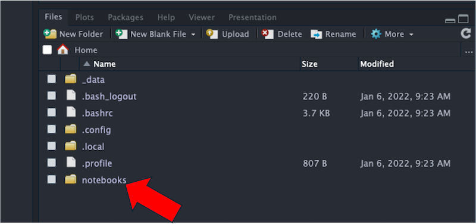
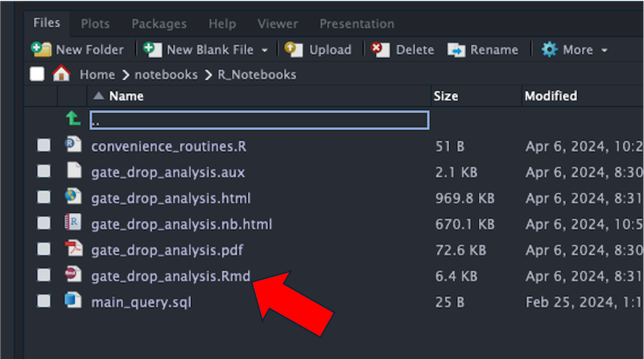
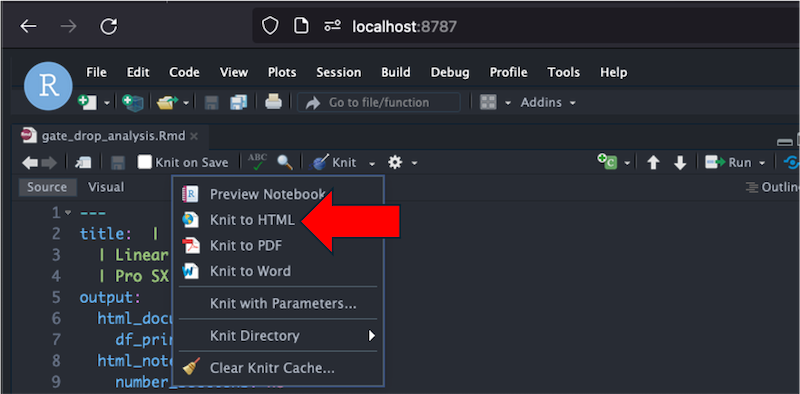

# Estimating the ET for the Gate Drop in Pro SX/MX

This repository contains the setup to analyze the gate drop times for Pro SX/MX. With data maintained in a SQLite database, the analysis in a RMarkdown file, and the entire ecosystem within a Docker container, everyone can verify the results with the exact same tools. And they can also extend it for new purposes.

------------------------------------------------------------------------

**TL;DR** The point estimate for the ET after the board goes sideways in the 450 main to be 5.42 seconds.

------------------------------------------------------------------------

A pre-generated PDF of the report is [here](./notebooks/R_Notebooks/gate_drop_analysis.pdf)

## Setup

-   Download and install [Docker Desktop](https://www.docker.com/products/docker-desktop/) for the Docker engine and Docker Compose; Docker Desktop is [free](https://www.docker.com/pricing/) for personal use\
-   Clone (with a git client) or download this repository
-   Make sure `Docker Desktop` is running on your system
-   Open a terminal / command line and navigate to where you cloned the directory
-   Start up the analysis environment:

``` zsh
docker compose -f compose-scs-rstudio.yml up
```

-   Navigate to the local web interface for the application: [localhost:8787](http://localhost:8787)
-   In the lower right files panel, click `notebooks` 
-   Next, click 'R_Notebooks\` \
-   Then, click `gate_drop_analysis.Rmd` to open the RNotebook 
-   Finally, re-run all the analysis and generate a fresh HTML report 

## Shutdown

-   Open a new command line / terminal and navigate to where you cloned the directory
-   Shutdown the analysis environment:

``` zsh
docker compose -f compose-scs-rstudio.yml down 
```
